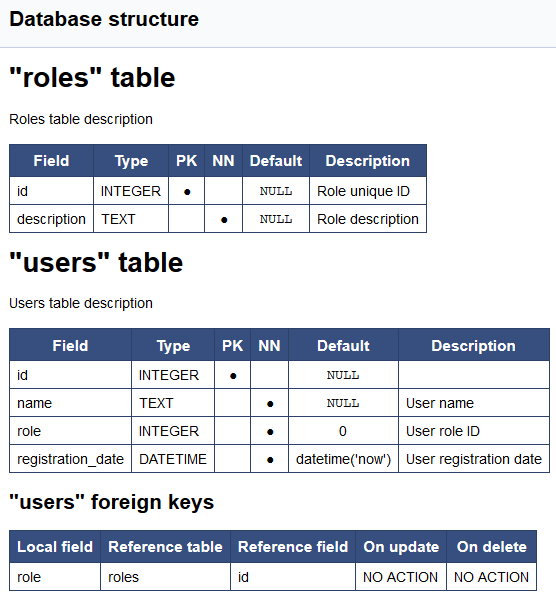

# Generating SQLite database documentation with Python and Doxygen #

Simple scripts for SQLite database documenting.

## Requirements ##

* Python 3
  - sqlite3 lib
  - json lib
* Doxygen

## Usage ##

SQLite does not support table and field comments so we are using external comment source (table_comments.json).

```json
{
    "table_name": {
        "comment": "Table comment",
        "fields": {
            "field_name": "Field comment",
            "field_name2": "Field comment 2"
        }
    },
}
```

* `python mksqlitedoc_json.py` - generates or updates comment source (table_comments.json)

* `python mksqlitedoc_json.py` - generates Doxygen input file

* `doxygen` - generates Doxygen documentation

## Result ##



Python is not my strong side